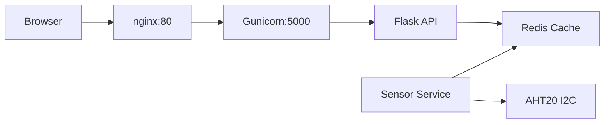

# Environmental Monitoring Dashboard (README CURRENTLY A WIP)

<div align="center">


Real-time IoT temperature and humidity monitoring with automated email alerts.

[Main Features](#main-features) •
[Installation & Setup](#-installation--setup) •
[Usage](#usage)


<p><b>gif is sped up 2x</b></p>
</div>

---


## Main Features

- 🌡️ **Real-time Monitoring** - AHT20 sensor via I2C protocol (2-second intervals)
- 📊 **Live Visualization** - Chart.js graphs with auto-scaling axes
- 📧 **Smart Alerts** - Email notifications when temperature exceeds/falls outside 17-26°C


## 🛠️ Tech Stack

| Layer | Technology |
|-------|-----------|
| **Backend** | Python (Flask), Gunicorn |
| **Cache** | Redis |
| **Proxy** | nginx |
| **Frontend** | HTML/CSS/JavaScript, Chart.js |
| **Hardware** | Raspberry Pi 5, AHT20 sensor |
| **Protocols** | I2C, HTTP/REST, SMTP |


## Architecture



## 📦 Installation & Setup

### Prerequisites
- Raspberry Pi (tested on Raspberry Pi 5, 64 bit RPi full OS)
- Adafruit AHT20 sensor connected via I2C
- Python 3.13+
- Redis server

### Quick Start
For a quick setup without using nginx:  
```bash
# Clone repository
git clone https://github.com/PanaAnt/environmental-monitoring-dashboard.git
cd environmental-monitoring-dashboard

# Setup virtual environment
python -m venv venv
# activate your environment, e.g.: source /abc/xyz/environmental-monitoring-dashboard/venv/bin/activate

# Install system dependencies
sudo apt-get update
sudo apt-get install redis-server -y

# Install Python packages 
pip install -r requirements.txt

# Configure environment
nano .env  # Add your mail credentials
```

### Quick Start with nginx  
```bash
# Clone repository
git clone https://github.com/PanaAnt/environmental-monitoring-dashboard.git
cd environmental-monitoring-dashboard

# Setup virtual environment
python -m venv venv

# Install system dependencies
sudo apt-get update
sudo apt-get install redis-server nginx -y

# Install Python packages 
pip install -r requirements.txt

# Configure environment
nano .env  # Add all relevant credentials

#configure nginx
sudo nano /etc/nginx/sites-available/default

#EXAMPLE of nginx setup
server {
    listen 80;
    server_name _;  # Change to your hostname or IP if desired
    location / {
           try_files $uri $url/ =404;
    }
    # Static files - served directly by nginx
    location /EnviroBoard/static/ {
        alias /home/JohnDoe/environmental-monitoring-dashboard/static/;
        expires 1d;
        add_header Cache-Control "public, immutable";
    }

    # API requests - proxied to Gunicorn
    location /EnviroBoard/ {
        proxy_pass http://127.0.0.1:5000/;
        
        # Proxy headers
        proxy_set_header Host $host;
        proxy_set_header X-Real-IP $remote_addr;
        proxy_set_header X-Forwarded-For $proxy_add_x_forwarded_for;
        proxy_set_header X-Forwarded-Proto $scheme;

        proxy_redirect off;
    }
}
```


## Usage

### Start Services

**Terminal 1 - Sensor Service:**
```bash
cd environmental-monitoring-dashboard
python sensor_service.py
```

**Terminal 2 - Web Server:**
```bash
cd environmental-monitoring-dashboard
gunicorn --workers <e.g. 4> --threads <e.g. 4> --worker-class gthread --bind <YOUR_IP>:<YOUR_PORT> app:app
```

### Access Dashboard

Open browser: `http://(YOUR_IP):(YOUR_PORT)/`


## API Endpoints

| Endpoint | Method | Description |
|----------|--------|-------------|
| `/api/sensor/latest` | GET | Latest sensor reading |
| `/api/sensor/history` | GET | Last 5 readings |
| `/api/status` | GET | System health |

**Example Response:**
```json
{
  "temperature": 21.45,
  "humidity": 45.32,
  "timestamp": 1738594850.123
}
```


## ⚙️ Configuration

Edit `.env` file:
```bash

SMTP_SERVER = smtp.gmail.com
SENDER_EMAIL=your_email@email.com
SENDER_PASSWORD=your_email_app_password
RECEIVER EMAIL=alert_recipient@email.com

TEMP_MIN=17.0      # Alert if below (°C)
TEMP_MAX=26.0      # Alert if above (°C)
ALERT_COOLDOWN=180 # Seconds between alerts
```


##⚡️Performance
NOTE: This is my attainment under my personal circumstances
- **Throughput:** 250+ requests/second
- **Response Time:** Sub-40ms average
- **Workers:** 4 parallel Gunicorn processes
- **Cache:** 5-reading rolling window (10 seconds)

### **APACHE BENCHMARK RESULTS**

**Main Page Dashboard:**
<div align="center">
  
</div>

<p></p>

**Latest sensor reading:**
<div align="center">
  
</div>

### Website Benchmarking (For windows)
<div>
  <p> You do not want to test the benchmarks on the RPi itself, but from a different device to get a more realistic reading. </p>
  <p> If you are on windows visit https://www.apachelounge.com/download/ and get the latest release. Follow the instructions on the official apache site or a reliable resource (this applies to other systems as well). </p>
</div>
To test the performance of the dashboard on a windows device, you can simply run: 

```bash
\Apache24\bin\ab.exe -n 1000 -c 10 http://{YOUR_URL}
```


## ⚠️ Troubleshooting

### Sensor not found
```bash
# Check if I2C is enabled
sudo raspi-config
# go to interface options, find I2C and then enable it and/or select 'yes' if prompted

# Check I2C devices
sudo apt-get install i2c-tools

#Look for i2c address
sudo i2cdetect -y 1

#This should return the I2C address: 0x38
```

### Email alerts not working
For gmail:
- Verify Gmail app password (not regular password)
- Check `.env` credentials
- Test: https://myaccount.google.com/apppasswords


### File permission issues
Whilst I was developing, I faced permission problems and it may happen to you so, check file permissions and make sure they have the right permissions. In my experience it required me using:
- chmod 755, 644, 711 
<p><b>WARNING</b>: I <b>STRONGLY</b> recommend checking permissions for your files on your system properly, and looking online for more detailed information. However, a very simplified table is below: </p>

| Command | Symbolic | Owner (u) | Group (g) | Others (o) | Usage |
| :--- | :--- | :--- | :--- | :--- | :--- |
| `chmod 755` | `rwxr-xr-x` | Read, Write, Execute | Read, Execute | Read, Execute | Public Directories/Scripts |
| `chmod 644` | `rw-r--r--` | Read, Write | Read | Read | Standard Documents/Images |
| `chmod 711` | `rwx--x--x` | Read, Write, Execute | Execute | Execute | Private Directories

### Adafruit related issues, circuitpython and more
It's important that you read information on the AHT20 hardware and Raspberry Pi itself. Useful links:
- https://learn.adafruit.com/adafruit-aht20/python-circuitpython
- https://learn.adafruit.com/circuitpython-on-raspberrypi-linux/overview
- https://gallaugher.com/makersnack-installing-circuitpython-on-a-raspberry-pi/ and https://www.youtube.com/watch?v=Epy6RvvpHOQ
- Check forums on https://learn.adafruit.com/ for specific issues or other reliable sites


### 📁 Project Structure
```
environmental-monitoring-dashboard/
├── app.py                 # Flask application
├── sensor_service.py      # Sensor polling service
├── sensor_logic/
│   └── __init__.py 
│   └── sensor.py         # AHT20 sensor class
├── templates/
│   └── index.html        # Dashboard
├── static/
│   └── styles.css        # Styling
└── requirements.txt      # Dependencies
```


## Contributing

Pull requests welcome! Please open an issue first to discuss changes.


## License

MIT License - see [LICENSE](LICENSE) file


## Acknowledgments

- [Flask](https://flask.palletsprojects.com/)
- [Chart.js](https://www.chartjs.org/)
- [Adafruit CircuitPython](https://circuitpython.org/)

---

<div align="center">
<p> If you found this project useful or interesting please star it, thank you! </p> 
Made by Panayiotis Antoniou
</div>
